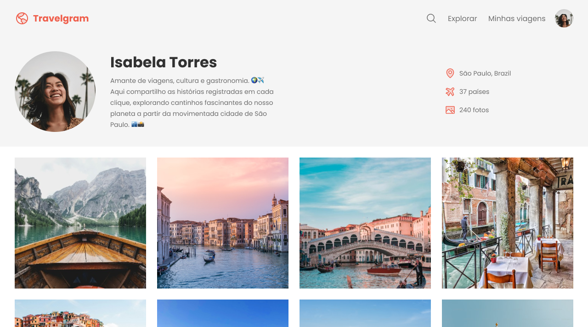

<h1 align="center"> Travelgram </h1>

Landing page de um perfil de viagens

  <a href="#-tecnologias">Tecnologias</a>&nbsp;&nbsp;&nbsp;|&nbsp;&nbsp;&nbsp;
  <a href="#-projeto">Projeto</a>&nbsp;&nbsp;&nbsp;|&nbsp;&nbsp;&nbsp;
  <a href="#-layout">Layout</a>&nbsp;&nbsp;&nbsp;|&nbsp;&nbsp;&nbsp;
  <a href="#memo-licença">Licença</a>

  

 

  

## 🚀 Tecnologias

Este projeto foi desenvolvido com as seguintes tecnologias:

- HTML e CSS
- Git e Github
- Figma

## 💻 Projeto

Esta web page foi desenvolvida durante o curso de programação web na trilha Full - Stack da [Rocketseat](https://www.rocketseat.com.br) com o intuito de ampliar meus conhecimentos com tecnologias web voltadas para o front-end.

## 🔖 Layout

Você pode visualizar o layout do projeto com mais detalhes através [DESSE LINK](<https://www.figma.com/design/tsSTSPaEC2BvVIKAc8iQ8Q/Perfil-de-viagens-(Community)?node-id=0-1&node-type=canvas&t=EU68JwyZKkBaItYW-0>). É necessário ter conta no [Figma](https://figma.com) para acessá-lo.

## :memo: Licença

Esse projeto está sob a licença MIT.

---

Feito com ♥ junto com a [Rocketseat](https://www.rocketseat.com.br)
